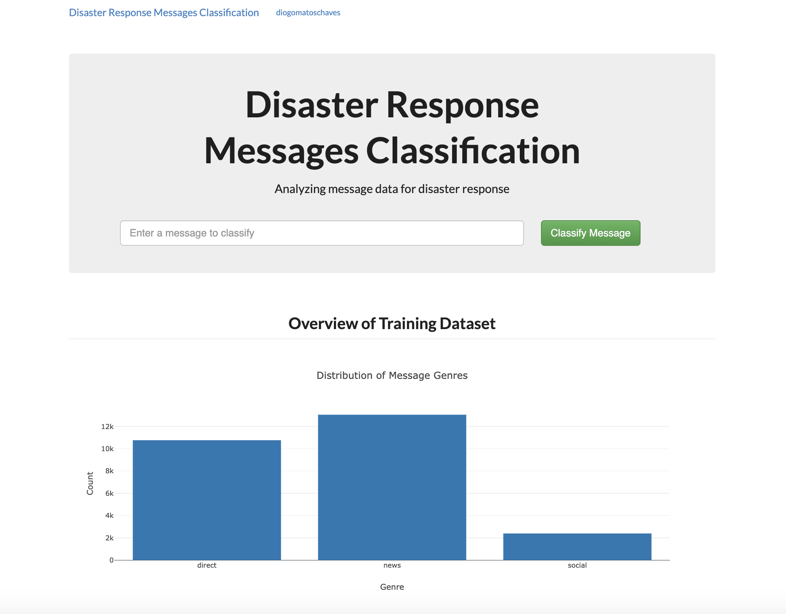
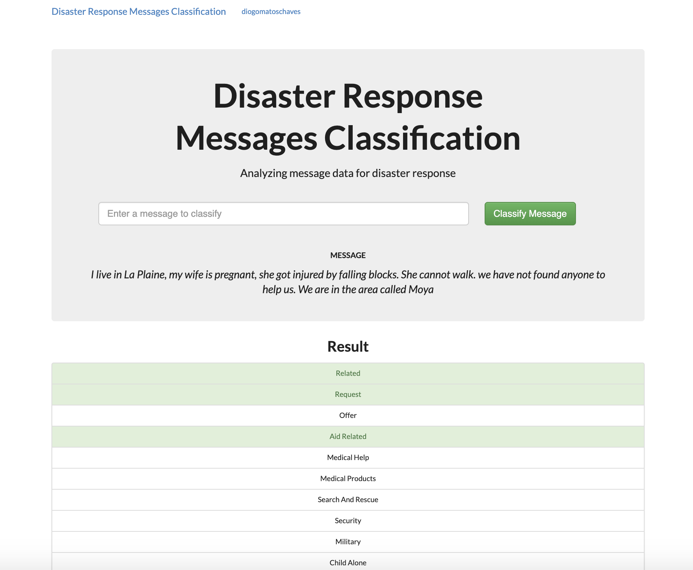
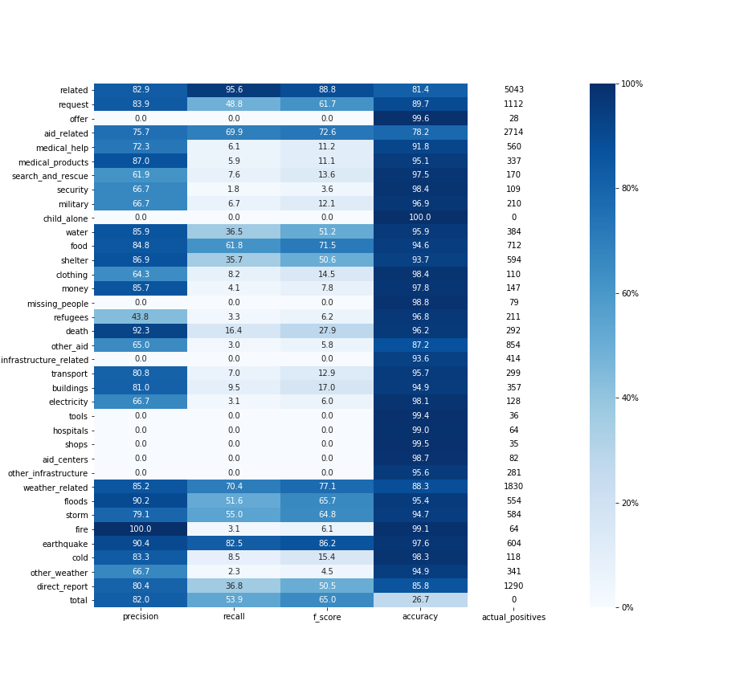

# Disaster Response Analysis

## Introduction

This project's goal is to create a classifier that correctly labels messages according to 36 different 'aid related' 
categories, in order to be used by disaster response and search and rescue teams around the world.
 
For this, a dataset consisting of (currently) ~26k messages and their respective categories is used as raw data, 
which, following a 2 step process of data cleaning and feature extraction / training, outputs a classifier that can be 
queried through a frontend application.

The main results of the model are:

| precision | recall | f1 score | accuracy |
|-----------|--------|----------|----------|
| 83%       | 53.9%    | 65%      |  26.7%

Main view                  |  Classified message view
:-------------------------:|:-------------------------:
  |  

## Quick Start

1. Create a virtual environment using `conda`: <br>
    ```conda env create --file environment.yml```

2. Run the following commands in the project's root directory to set up your database and model.

    - To run ETL pipeline that cleans data and stores in database <br>
        ```python data/process_data.py data/disaster_messages.csv data/disaster_categories.csv data/DisasterResponse.db```
    - To run ML pipeline that trains classifier and saves <br>
        ```python models/train_classifier.py data/DisasterResponse.db models/classifier.pkl```

3. Run the following command in the app's directory to run your web app. <br>
    `python run.py`

4. Go to http://0.0.0.0:3001/

## Libraries

The main libraries used in this application are:

- `scikit-learn`
- `nltk`
- `Flask`
- `pandas`
- `numpy`
- `sqlalchemy`

## Dataset

The data comes in two different csv files, `disaster_messages.csv` and `disaster_categories.csv`, found in the `data`
directory. 

## ETL pipeline

This pipeline consists on the steps to ingest the csv files, and to clean transform and save the data in a sqlite database.

To run the pipeline, execute:

```python data/process_data.py data/disaster_messages.csv data/disaster_categories.csv data/DisasterResponse.db```

The notebook with these steps can be found in `data/ETL_Pipeline_Preparation.ipynb`.

## ML Pipeline

This pipeline consists on loading the data from the database, build the model pipeline, and train and evaluate the model.

The main pipeline is of the form:

```python
pipeline = Pipeline([
    ('features', FeatureUnion([
        ('text_processing', Pipeline([
            ('vect', CountVectorizer(tokenizer=tokenize)),
            ('tfidf', TfidfTransformer()),
        ])),
        ('verb_counter_normalized', Pipeline([
            ('count_verbs', VerbCounter()),
            ('scaler', StandardScaler())
        ]))
    ])),
    ('clf', MultiOutputClassifier(RandomForestClassifer(n_estimators=200)))
])
```

The pipeline above consists on 2 main steps: Feature selection / extraction and model training.

**Feature extraction**

This step consists on creating a `TfIdf` matrix using a custom tokenizing function, as well as adding an extra feature 
which counts the number of verbs in each message. 

**Model training**

This step takes as input the extracted features and fits the training data onto the classifier. 

## Results

The precision, recall, f1 score and accuracy were calculated for all categories. As some categories are highly 
imbalanced (have few occurrences of one of the classes), the recall is low for these categories. 



One way to rebalance the dataset for these categories would be to use the approaches of over-sampling or under-sampling.
With over-sampling, we would increase the number of occurrences of the minority label, whereas with under-sampling we 
would reduce the number of occurrences of the majority label, albeit with some loss in information of the data.

## Tests

In order to run the tests, execute the following command:

```python -m pytest```

with an optional `--verbose` at the end for more explicit results.